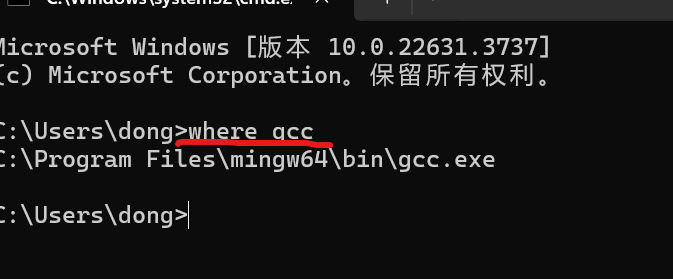

### 下载
vscode官网:[vscode](https://code.visualstudio.com/ "VSCO的官网")  

### VSCO的汉化
插件搜chinese  


### MINGW
**1.下载mingw**
MINGW官网:[官网](https://www.mingw-w64.org/)  

下载地址:[下载地址](https://sourceforge.net/projects/mingw-w64/files/mingw-w64/mingw-w64-release/)  
  

最后解压  
  
**2.加入环境变量**  
将解压后的mingw文件移动的合适的位置  

将mingw文件中的bin文件地址复制下来  


验证是否加入成功:
  

### 配置vscode
如写c语言装c的相关插件
随便写一段c,并点击调试  

然后编译器选择gcc

之后会自动生成一个tasks.json的文件  

```
{
    "version": "2.0.0",
    "tasks": [
        {
            "type": "cppbuild",
            "label": "C/C++: gcc.exe 生成活动文件",
            "command": "C:\\Program Files\\mingw64\\bin\\gcc.exe",  //gcc安装路径
            "args": [
                "-fdiagnostics-color=always",
                "-g",
                "*.c",  // 当前文件夹的所有.c文件都编译
                "-o",
                "${fileDirname}\\a.exe"
            ],
            "options": {
                "cwd": "${fileDirname}"
            },
            "problemMatcher": [
                "$gcc"
            ],
            "group": {
                "kind": "build",
                "isDefault": true
            },
            "detail": "调试器生成的任务。"
        },

        //每次调试完都执行清屏操作
        {
            "label": "clearTerminal",
            "type": "shell",
            "command": "cls", // Windows 清屏命令，对应 Linux/macOS 可用 clear
            "presentation": {
                "reveal": "always",
                "panel": "new",
                "clear": true
            },
            "problemMatcher": []
        }
    ]
}
```  

### vscode调试程序
  

会有一个launch.json文件生成  

```
{
    // 使用 IntelliSense 了解相关属性。 
    // 悬停以查看现有属性的描述。
    // 欲了解更多信息，请访问: https://go.microsoft.com/fwlink/?linkid=830387
    "version": "0.2.0",
    "configurations": 
    [
        {
            "name": "(gdb) 启动",
            "type": "cppdbg",
            "request": "launch",
            //"program": "输入程序名称，例如 ${workspaceFolder}/a.exe",
            "program": "${fileDirname}\\a.exe",
            "args": [],
            "stopAtEntry": false,
            "cwd": "${fileDirname}",
            "environment": [],
            "externalConsole": false,    //是否调用外部的控制台
            "MIMode": "gdb",
            //"miDebuggerPath": "/path/to/gdb",
            "miDebuggerPath": "C:\\Program Files\\mingw64\\bin\\gdb.exe",
            "setupCommands": 
            [
                {
                    "description": "为 gdb 启用整齐打印",
                    "text": "-enable-pretty-printing",
                    "ignoreFailures": true
                },
                {
                    "description": "将反汇编风格设置为 Intel",
                    "text": "-gdb-set disassembly-flavor intel",
                    "ignoreFailures": true
                }
            ],
            "postDebugTask": "clearTerminal"   // 添加此行确保调试后清屏任务执行
        }
    ]
}
``` 
